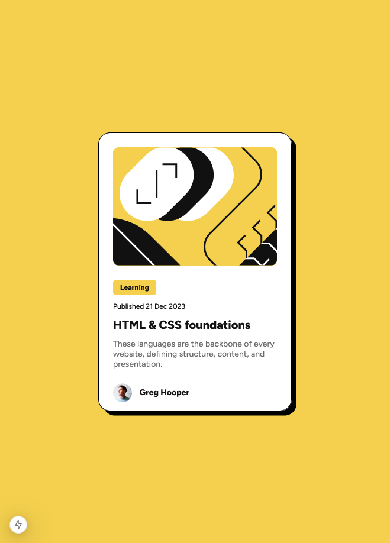

# Blog preview card

This project is a basic static page exercise. The main objective was to design and implement a responsive Card component that adapts seamlessly to both mobile devices and desktop computers. The component follows mobile-first principles, ensuring compatibility across various screen sizes and delivering an optimal user experience.

## Table of contents

- [Overview](#overview)
  - [The challenge](#the-challenge)
  - [Screenshot](#screenshot)
  - [Links](#links)
- [My process](#my-process)
  - [Built with](#built-with)
  - [What I learned](#what-i-learned)
  - [Continued development](#continued-development)
  - [Useful resources](#useful-resources)
- [Author](#author)
- [Acknowledgments](#acknowledgments)

## Overview

### The challenge

Users should be able to:

- Create a Card component that displays a preview, including a featured image, for an article about HTML and CSS foundations.
- See hover and focus states for all interactive elements on the page

### Screenshot

